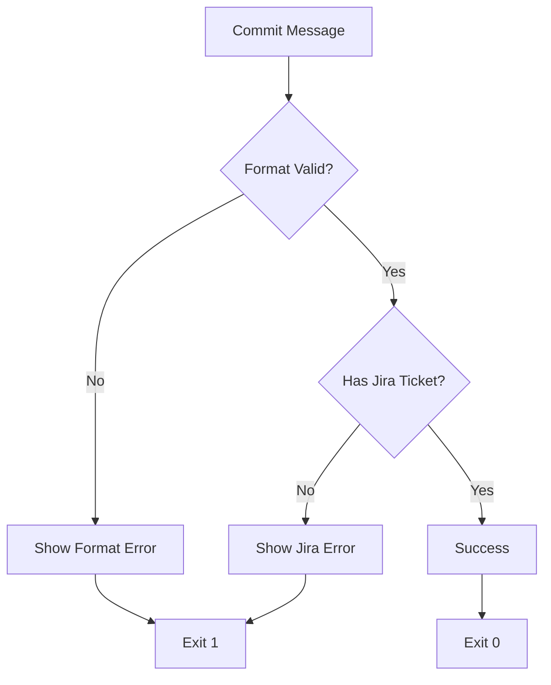
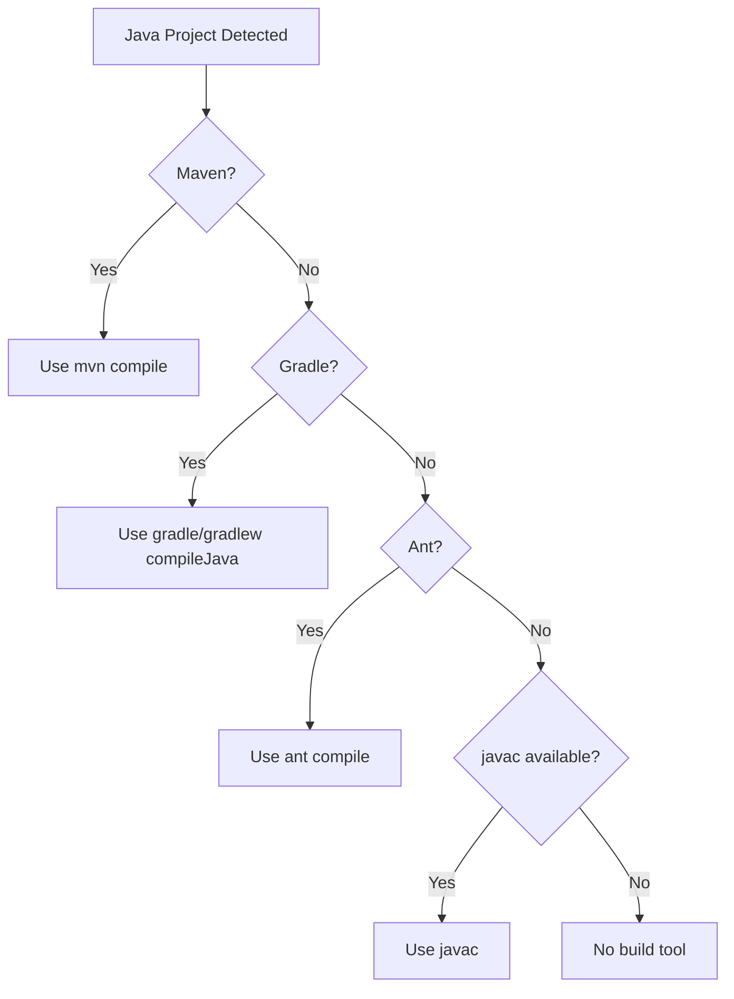
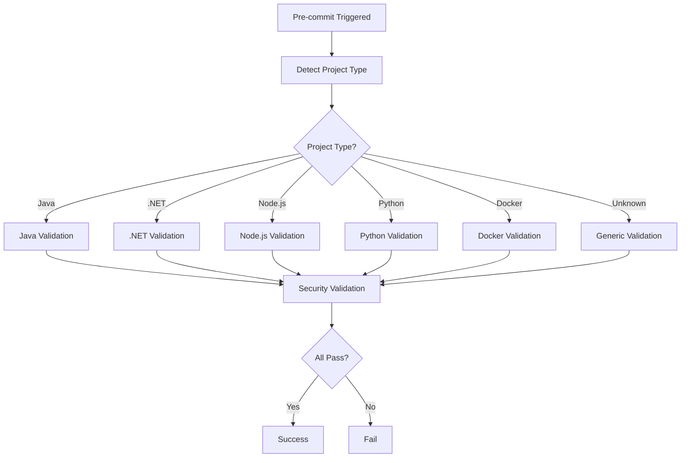
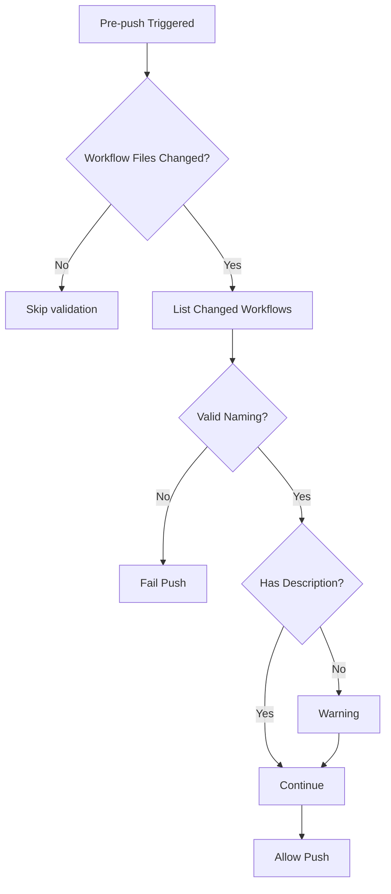

# GitHooks Decision Points and Configuration

This document outlines all configuration decisions, validation rules, and user prompts across the three git hooks in this repository.

---

## Table of Contents

1. [commit-msg Hook](#commit-msg-hook)
2. [pre-commit Hook](#pre-commit-hook)
3. [pre-push Hook](#pre-push-hook)
4. [Summary Matrix](#summary-matrix)

---

## commit-msg Hook

### Purpose
Enforces organizational commit message standards including Jira ticket requirements.

### Configuration Decisions

| Configuration | Value | Description |
|--------------|-------|-------------|
| **Commit Format Regex** | `^(feat\|fix\|docs\|style\|refactor\|test\|chore\|workflow)(\([^)]+\))?: .{1,200}$` | Validates conventional commit format |
| **Jira Ticket Regex** | `[A-Za-z][A-Za-z0-9]+-[0-9]+` | Pattern for valid Jira ticket numbers |
| **Description Length** | 1-200 characters | Min and max commit message length |
| **Scope** | Optional but recommended | Scope in parentheses after type |
| **Jira Ticket** | Mandatory | Must include valid Jira ticket |

### Allowed Commit Types

| Type | Purpose | Example |
|------|---------|---------|
| `feat` | New features | `feat(auth): JIRA-123 add OAuth2 authentication` |
| `fix` | Bug fixes | `fix(api): DEV-456 resolve user registration bug` |
| `docs` | Documentation changes | `docs: PROJ-789 update setup instructions` |
| `style` | Code style changes (formatting) | `style(ui): TASK-101 apply consistent indentation` |
| `refactor` | Code refactoring | `refactor(core): TASK-101 optimize database queries` |
| `test` | Adding or updating tests | `test(unit): BUG-202 add user service tests` |
| `chore` | Maintenance tasks | `chore(deps): DEV-303 update dependencies` |
| `workflow` | CI/CD and workflow changes | `workflow: DEVOPS-404 update build pipeline` |

### Jira Ticket Patterns

Valid Jira ticket formats (case-insensitive):
- `JIRA-123` (standard Jira project)
- `DEV-456` (development tasks)
- `PROJ-789` (project-specific)
- `DevOps-101` (mixed case allowed)
- `BUG-202` (bug tracking)

### Validation Flow



### User Prompts & Messages

#### Error: Invalid Format
```
[ERROR] Invalid commit message format!

ORGANIZATIONAL COMMIT STANDARDS

Format: <type>(<scope>): <description>

Available Types:
  feat     - New features
  fix      - Bug fixes
  docs     - Documentation changes
  style    - Code style changes (formatting, etc.)
  refactor - Code refactoring
  test     - Adding or updating tests
  chore    - Maintenance tasks
  workflow - CI/CD and workflow changes

Requirements:
    • Description: 1-200 characters
    • Scope: optional but recommended
    • Must include Jira ticket number

Examples:
    feat(auth): JIRA-123 add OAuth2 authentication
    fix(api): DEV-456 resolve user registration bug
    docs: PROJ-789 update setup instructions
    refactor(core): TASK-101 optimize database queries
```

#### Error: Missing Jira Ticket
```
[ERROR] Missing Jira ticket number in commit message!

ORGANIZATIONAL JIRA REQUIREMENT

Requirement:
  All commits must include a Jira ticket number

Format:
    PROJ-123 (project key + hyphen + number)
    Mixed case allowed: DevOps-123, MyProj-456

Valid Patterns:
    • JIRA-123   (standard Jira project)
    • DEV-456    (development tasks)
    • PROJ-789   (project-specific)
    • DevOps-101 (mixed case allowed)
    • BUG-202    (bug tracking)

Examples:
    feat(auth): JIRA-123 add OAuth2 authentication
    fix(api): DEV-456 resolve user registration bug
    docs: PROJ-789 update setup instructions
    test(unit): TASK-101 add user service tests
```

#### Success
```
VALIDATION SUCCESSFUL

[SUCCESS] Commit message format validated
[SUCCESS] Jira ticket number validated

Commit Details:
  Type: feat
  Jira Ticket: JIRA-123
  Message: feat(auth): JIRA-123 add OAuth2 authentication
```

---

## pre-commit Hook

### Purpose
Performs comprehensive build, security, and code quality validation before commits are finalized.

### Global Configuration

| Configuration | Value | Description |
|--------------|-------|-------------|
| **FAIL_ON_ERROR** | `true` | Production mode - fails on errors |
| **VERBOSE** | `false` | Debug logging disabled |
| **SECURITY_FAIL_ON_SECRETS** | `true` | Fail if secrets detected |
| **SECURITY_MAX_FILE_SIZE** | `5M` | Maximum allowed file size |
| **PREFERRED_BUILD_TOOL** | `auto` | Auto-detect build tool |

### Security Patterns

Detection patterns for hardcoded secrets:
```regex
password\s*[=:]\s*["'][^"']{8,}
secret\s*[=:]\s*["'][^"']{8,}
(?<!sonar\.)token\s*[=:]\s*["'][^"']{20,}
api_key\s*[=:]\s*["'][^"']{20,}
auth_token\s*[=:]\s*["'][^"']{20,}
```

**Exclusions** (false positive prevention):
- Comments (`//`, `#`, `*`)
- Example code
- Placeholder text
- Constant declarations (`final String API_KEY`, `const apikey`)
- Static/readonly fields

### Project Type Detection

| Project Type | Detection Files | Priority |
|-------------|-----------------|----------|
| **Java** | `pom.xml`, `build.gradle`, `*.java` | High |
| **.NET** | `*.csproj`, `*.sln` | High |
| **Node.js** | `package.json` | Medium |
| **Python** | `requirements.txt`, `pyproject.toml`, `setup.py` | Medium |
| **Docker** | `Dockerfile` | Low |

### Java Build Tool Priority

The hook detects and uses Java build tools in this priority order:



#### 1. Maven (Highest Priority - Enterprise)
- **Detection**: `pom.xml` exists + `mvn` command available
- **Command**: `mvn compile -q`
- **Version Display**: Maven version from `mvn --version`

#### 2. Gradle (Modern Android/Spring)
- **Detection**: `build.gradle` or `build.gradle.kts` exists
- **Preference**: Gradle Wrapper (`./gradlew`) over system Gradle
- **Command**: `./gradlew compileJava --quiet` or `gradle compileJava --quiet`
- **Version Display**: From wrapper properties or `gradle --version`

#### 3. Ant (Legacy Enterprise)
- **Detection**: `build.xml` exists + `ant` command available
- **Command**: `ant compile -q` (if compile target exists)
- **Version Display**: Ant version from `ant -version`

#### 4. javac (Fallback - Simple Projects)
- **Detection**: `javac` command available
- **Behavior**: Compiles only staged `.java` files (max 5 for performance)
- **Classpath**: Auto-detects from `lib/`, `target/classes/`, `build/classes/`
- **Command**: `javac -cp $CLASSPATH -d /tmp [files]`

### Java Security Checks

| Check | Severity | Action |
|-------|----------|--------|
| **Runtime.exec() usage** | ERROR | Fail commit |
| **ProcessBuilder usage** | ERROR | Fail commit |
| **System.out.println in production** | WARNING | Allow with warning |
| **System.err.print in production** | WARNING | Allow with warning |

Search paths:
- Only checks `*/src/main/*` (excludes test code)
- Scans max 10 files for performance

### .NET Validations

| Validation | Command | Fail Condition |
|------------|---------|----------------|
| **Build** | `dotnet build --no-restore --verbosity quiet` | Build errors |
| **Formatting** | `dotnet format --verify-no-changes` | Formatting issues |
| **Connection Strings** | Grep for `ConnectionStrings.*localhost` | Hardcoded localhost |

Files checked: `*.json`, `*.config`

### Node.js Validations

| Validation | Requirement | Fail Condition |
|------------|-------------|----------------|
| **Lock File** | package-lock.json or yarn.lock | Missing lock file |
| **package.json Syntax** | Valid JSON | Parse errors |
| **ESLint** | `npx eslint . --max-warnings 0` | Linting errors/warnings |
| **Security Audit** | `npm audit --audit-level moderate` | Moderate+ vulnerabilities |

### Security Validations (All Projects)

#### 1. Secret Scanning
- Scans all staged files
- Excludes comments, examples, placeholders, constant declarations
- **Fail if found**: Passwords, tokens, API keys with actual values

#### 2. Large File Detection
- **Threshold**: 5MB
- **Action**: Warning only (does not fail)
- **Exclusion**: `.git/` folder

#### 3. Sensitive File Detection
Protected file patterns:
- `.env`, `.env.local`, `.env.production`
- `id_rsa`, `id_dsa`
- `*.pem`, `*.key`, `*.p12`, `*.pfx`

**Action**: Fail if tracked or staged

### Validation Flow



### User Prompts & Messages

#### Informational
```
[VALIDATE] Validating commit message...
[BUILD TOOL] Maven 3.9.0
[JAVA] Running comprehensive Java validation...
[SECURITY] Running security validation...
[SECURITY] Scanning 15 staged files for secrets
```

#### Errors
```
[ERROR] Maven compilation failed - run 'mvn compile' for details
[ERROR] Security violation: Runtime.exec() or ProcessBuilder usage detected
[ERROR] Hardcoded secrets detected in staged files
[ERROR] Sensitive file detected in repository: .env
[ERROR] .NET build validation failed
[ERROR] ESLint validation failed - fix linting issues
[ERROR] npm security audit failed - run 'npm audit fix'
```

#### Warnings
```
[WARNING] No recognized Java build tool found (Maven, Gradle, Ant, javac)
[WARNING] System.out.println detected in production code - consider using proper logging
[WARNING] Large files (>5M) detected
[WARNING] Potential secrets detected (test mode - would fail in production)
```

#### Success Summary
```
SUMMARY Validation completed for java project:
   Java build validation (Maven/Gradle/Ant/javac)
   Security scanning (secrets, sensitive files)
   File size and performance checks
   Organizational policies enforced

[SUCCESS] Production validation passed - organizational standards enforced
```

---

## pre-push Hook

### Purpose
Validates GitHub Actions workflow files before pushing to ensure naming conventions and documentation standards.

### Workflow Naming Convention

| Rule | Pattern | Valid | Invalid |
|------|---------|-------|---------|
| **Case** | Lowercase only | `build-deploy.yml` | `Build-Deploy.yml` |
| **Separator** | Hyphens | `security-scan.yaml` | `security_scan.yaml` |
| **Format** | Kebab-case | `unit-testing-template.yml` | `unitTestingTemplate.yml` |
| **Extension** | `.yml` or `.yaml` | Both allowed | `.YML`, `.YAML` |

**Regex**: `^[a-z0-9]+(-[a-z0-9]+)*\.(yml|yaml)$`

### Documentation Requirements

Each workflow file should include either:
- `description:` field in workflow metadata
- `# Description:` comment at the top

**Enforcement**: Warning only (does not fail push)

### Detection Logic

Only validates files matching:
- Path: `.github/workflows/*`
- Extension: `.yml` or `.yaml`
- Status: Changed in the push (compared to remote)

### Validation Flow



### User Prompts & Messages

#### Informational
```
Running pre-push validation...
Detected workflow changes:
    .github/workflows/build-and-deploy.yml
    .github/workflows/security-scan.yaml
Checking workflow naming conventions...
Validating workflow documentation...
```

#### Errors
```
Workflow file 'Build-Deploy.yml' doesn't follow naming convention
   Use kebab-case: build-and-deploy.yml, security-scan.yaml, etc.
```

#### Warnings
```
Workflow '.github/workflows/build.yml' is missing description
   Consider adding a description for better maintainability
```

#### Success
```
Workflow validation completed
Pre-push checks passed! Pushing changes...
```

---

## Summary Matrix

### Enforcement Levels by Hook

| Hook | Primary Focus | Fail Conditions | Warning Conditions | Can Be Bypassed? |
|------|--------------|-----------------|-------------------|------------------|
| **commit-msg** | Message format | Invalid format, Missing Jira | None | No (enforced) |
| **pre-commit** | Build & security | Compilation errors, Secrets, Security violations | Large files, println in code | No (production mode) |
| **pre-push** | Workflow quality | Invalid naming | Missing description | No (enforced) |

### Decision Points Quick Reference

#### When commit-msg Fails
1. Invalid commit type (not in allowed list)
2. Missing or incorrect format (no colon, wrong structure)
3. Description length < 1 or > 200 characters
4. Missing Jira ticket number
5. Invalid Jira ticket format

#### When pre-commit Fails
1. **Build**: Compilation errors in detected language
2. **Security**: Hardcoded secrets detected
3. **Security**: Sensitive files (.env, keys) in repo
4. **Security**: Runtime.exec() in Java production code
5. **.NET**: Hardcoded connection strings
6. **Node.js**: Missing lock file
7. **Node.js**: ESLint errors/warnings
8. **Node.js**: npm security vulnerabilities

#### When pre-push Fails
1. Workflow filename not in kebab-case
2. Workflow filename contains uppercase letters
3. Workflow filename uses underscores instead of hyphens

### Configuration Override Options

To adjust behavior, modify these variables:

**commit-msg:**
- Edit `commit_regex` for different format
- Edit `jira_regex` for different ticket patterns

**pre-commit:**
- Set `FAIL_ON_ERROR=false` for test mode
- Set `VERBOSE=true` for debug output
- Adjust `SECURITY_MAX_FILE_SIZE` for different threshold
- Set `SECURITY_FAIL_ON_SECRETS=false` to warn instead of fail

**pre-push:**
- Currently no configuration variables (hardcoded rules)

---

## Best Practices

### For Developers

1. **Before Committing:**
   - Ensure code compiles locally
   - Run build tool manually: `mvn compile`, `dotnet build`, etc.
   - Check for hardcoded secrets
   - Use proper logging instead of `System.out.println`

2. **Commit Messages:**
   - Always include Jira ticket: `feat(api): JIRA-123 description`
   - Keep descriptions concise (1-200 chars)
   - Use appropriate commit type

3. **Before Pushing:**
   - Verify workflow files use kebab-case naming
   - Add descriptions to new workflows
   - Test workflows locally if possible

### For Administrators

1. **Customizing Hooks:**
   - Modify regex patterns for project-specific requirements
   - Adjust security thresholds based on repository needs
   - Add custom validation rules in respective sections

2. **Troubleshooting:**
   - Enable `VERBOSE=true` in pre-commit for debugging
   - Check hook execution logs in git output
   - Verify hook file permissions (must be executable)

3. **Updating Hooks:**
   - Test changes in non-production branch first
   - Document any organizational policy changes
   - Communicate updates to development team

---

## Maintenance Notes

- **Last Updated**: January 21, 2026
- **Version**: 1.0
- **Maintained By**: DevOps Team
- **Review Frequency**: Quarterly

### Change Log

| Date | Hook | Change | Reason |
|------|------|--------|--------|
| 2026-01-21 | All | Initial documentation | Standardize hooks |

---

## Support & Contact

For questions or issues with git hooks:
1. Check this documentation first
2. Review hook output messages (they include guidance)
3. Contact DevOps team for policy exceptions
4. Submit issues to central-devops-config repository
